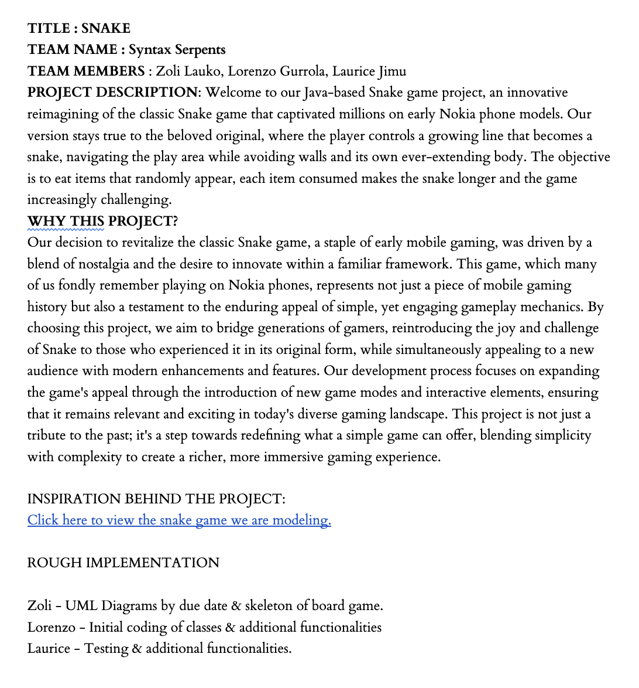
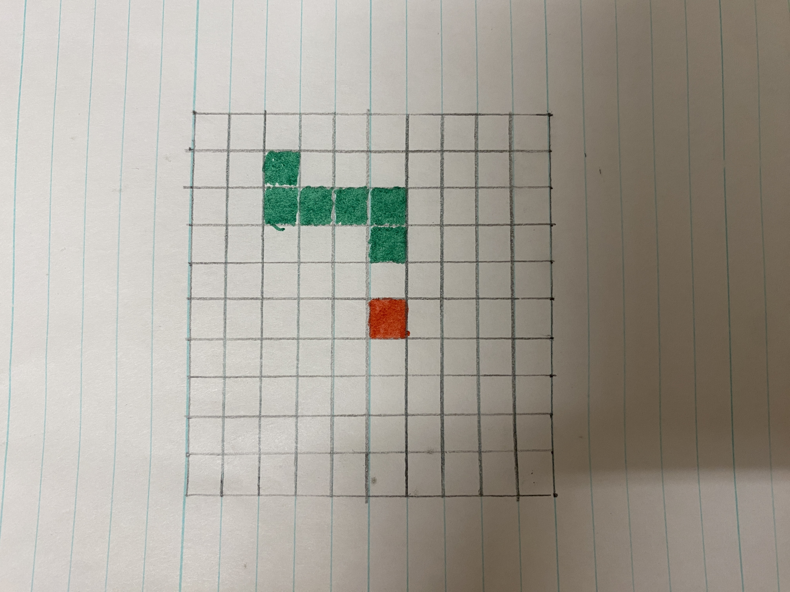
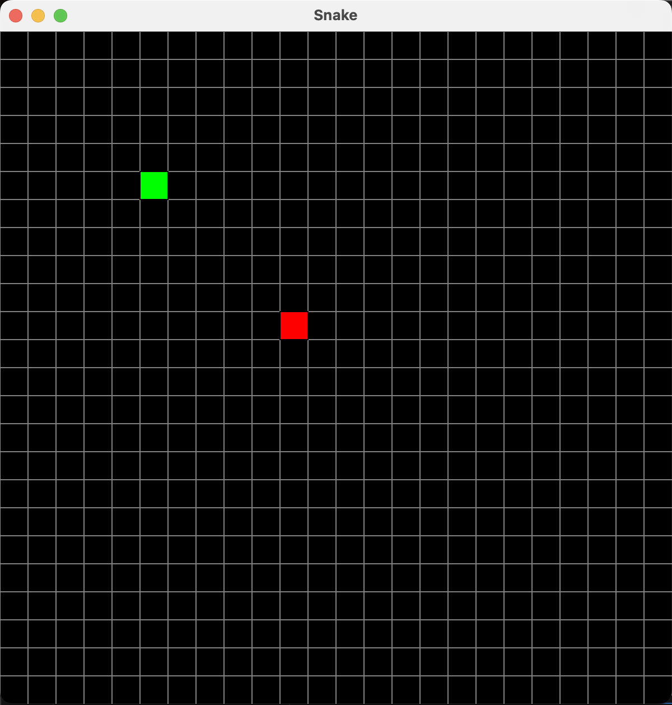

# Team Syntax Serpents - Snake Rendition
## Proposal, Sketch, and UML Class Diagram

## Requirements

Java 22 and VS Code installed on your machine is required to run this program.

## How To Run

To run the program, simply clone this repository to your machine, preferably with GitHub Desktop, open the repo in VS Code, navigate to src/SnakeGame.java, and run the program. To play the game, click the start button and use the arrow keys to navigate your snake to the red food objects while avoiding running into the walls or yourself. The goal of the game is to get the highest score possible!

## Limitations

The only bug that we have encountered is that, if the snake is traveling in one direction, then if you quickly press a key to change direction and then press the key that goes in the opposite of the original direction, then the snake seemingly 'turns back on itself' without changing direction in the first place. This is caused by the implementation of the canvas.animate method, so it was very difficult to attempt to fix.

## References

We referenced previous activities and labs in order to see the best ways to work with the kilt graphics library to implement our game.

## Main Window

